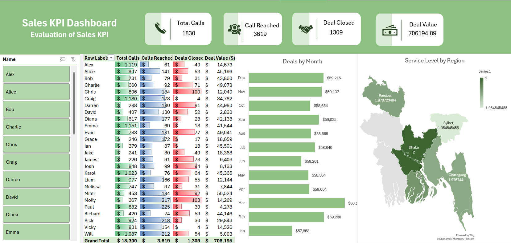

📊 Sales KPI Dashboard – Excel Project
Overview
This project is an interactive Excel dashboard built to evaluate and monitor key sales performance indicators (KPIs).
It provides a visual, filterable, and data-driven view of sales activity, helping identify trends, measure performance, and support decision-making.

🎯 Objectives
Track Total Calls, Calls Reached, Deals Closed, and Deal Value.

Allow quick filtering by sales agent using slicers.

Display regional service levels using a map visualization.

Analyze monthly deal trends and agent performance.

🛠 Tools & Features Used
Power Query – Cleaned and transformed raw data.

Pivot Tables – Summarized and analyzed sales metrics.

Slicers – Enabled interactive filtering by sales agent.

Pivot Charts – Created KPI visuals and trend graphs.

Map Chart – Displayed service levels by region.

Conditional Formatting – Highlighted performance patterns.

📷 Dashboard Preview

📂 Repository Contents
File	Description
Call Center Dashboard.xlsx	
Main Excel file with fully interactive dashboard

Static preview of the dashboard

🚀 How to Use
Download and open Call Center Dashboard.xlsx in Excel 2016 or later.

Use the Name slicer to filter by sales agent.

Explore monthly, regional, and KPI views interactively.

📈 Key Insights from the Dashboard
Identifies top-performing agents and areas needing improvement.

Shows seasonal sales trends across months.

Highlights regional performance differences.

💡 Skills Demonstrated
Data cleaning & transformation (Power Query)

KPI analysis & summarization (Pivot Tables)

Dashboard design & storytelling

Interactive Excel features (Slicers, Map Charts)

